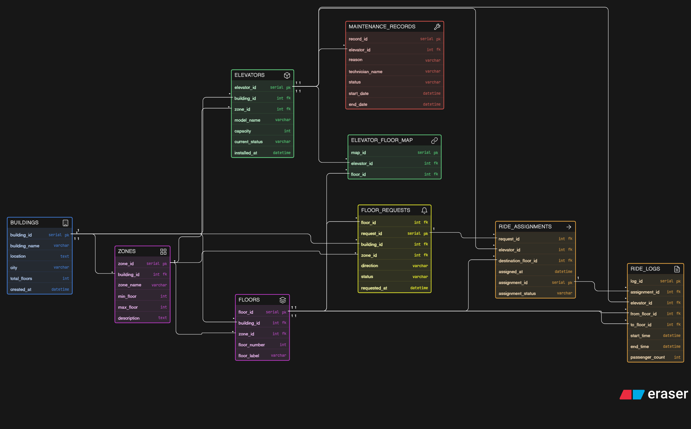

# 🚀 Smart Elevator Control System – ER Diagram

## 📌 Overview
This project models a **Smart Elevator Control System** designed for managing elevator operations across multi-building infrastructures.

It captures the complete workflow:
- Floor request generation
- Elevator assignment
- Ride execution
- Ride logging
- Maintenance tracking

---

## 🖼️ ER Diagram

---

## 🧱 Core Entities

### 🏢 BUILDINGS
Stores information about buildings.
- `building_id` (PK)
- `building_name`
- `location`
- `city`
- `total_floors`
- `created_at`

---

### 🧩 ZONES
Logical grouping of floors within a building.
- `zone_id` (PK)
- `building_id` (FK)
- `zone_name`
- `min_floor`
- `max_floor`
- `description`

---

### 🏬 FLOORS
Represents individual floors.
- `floor_id` (PK)
- `building_id` (FK)
- `zone_id` (FK)
- `floor_number`
- `floor_label`

---

### 🛗 ELEVATORS
Stores elevator details.
- `elevator_id` (PK)
- `building_id` (FK)
- `zone_id` (FK)
- `model_name`
- `capacity`
- `current_status`
- `installed_at`

---

### 🔗 ELEVATOR_FLOOR_MAP
Defines which floors an elevator serves.
- `map_id` (PK)
- `elevator_id` (FK)
- `floor_id` (FK)

---

### 🔔 FLOOR_REQUESTS
Captures elevator requests.
- `request_id` (PK)
- `floor_id` (FK)
- `building_id` (FK)
- `zone_id` (FK)
- `direction` (up/down)
- `status`
- `requested_at`

---

### ➡️ RIDE_ASSIGNMENTS
Maps requests to elevators.
- `assignment_id` (PK)
- `request_id` (FK)
- `elevator_id` (FK)
- `destination_floor_id` (FK)
- `assigned_at`
- `assignment_status`

---

### 📄 RIDE_LOGS
Tracks completed rides.
- `log_id` (PK)
- `assignment_id` (FK)
- `elevator_id` (FK)
- `from_floor_id` (FK)
- `to_floor_id` (FK)
- `start_time`
- `end_time`
- `passenger_count`

---

### 🛠️ MAINTENANCE_RECORDS
Tracks elevator maintenance.
- `record_id` (PK)
- `elevator_id` (FK)
- `reason`
- `technician_name`
- `status`
- `start_date`
- `end_date`

---

## 🔗 Relationships

- `BUILDINGS.building_id < ZONES.building_id`
- `BUILDINGS.building_id < FLOORS.building_id`
- `BUILDINGS.building_id < ELEVATORS.building_id`
- `BUILDINGS.building_id < FLOOR_REQUESTS.building_id`

- `ZONES.zone_id < FLOORS.zone_id`
- `ZONES.zone_id < ELEVATORS.zone_id`
- `ZONES.zone_id < FLOOR_REQUESTS.zone_id`

- `ELEVATORS.elevator_id < ELEVATOR_FLOOR_MAP.elevator_id`
- `FLOORS.floor_id < ELEVATOR_FLOOR_MAP.floor_id`

- `FLOORS.floor_id < FLOOR_REQUESTS.floor_id`

- `FLOOR_REQUESTS.request_id < RIDE_ASSIGNMENTS.request_id`
- `ELEVATORS.elevator_id < RIDE_ASSIGNMENTS.elevator_id`
- `FLOORS.floor_id < RIDE_ASSIGNMENTS.destination_floor_id`

- `RIDE_ASSIGNMENTS.assignment_id < RIDE_LOGS.assignment_id`
- `ELEVATORS.elevator_id < RIDE_LOGS.elevator_id`
- `FLOORS.floor_id < RIDE_LOGS.from_floor_id`
- `FLOORS.floor_id < RIDE_LOGS.to_floor_id`

- `ELEVATORS.elevator_id < MAINTENANCE_RECORDS.elevator_id`

---

## ⚙️ Design Highlights

- ✅ Normalized schema (minimal redundancy)
- ✅ Supports multiple buildings and zones
- ✅ Flexible elevator-floor mapping
- ✅ Full ride lifecycle tracking
- ✅ Maintenance and downtime tracking

## 📌 Author
Abhiran DAs
